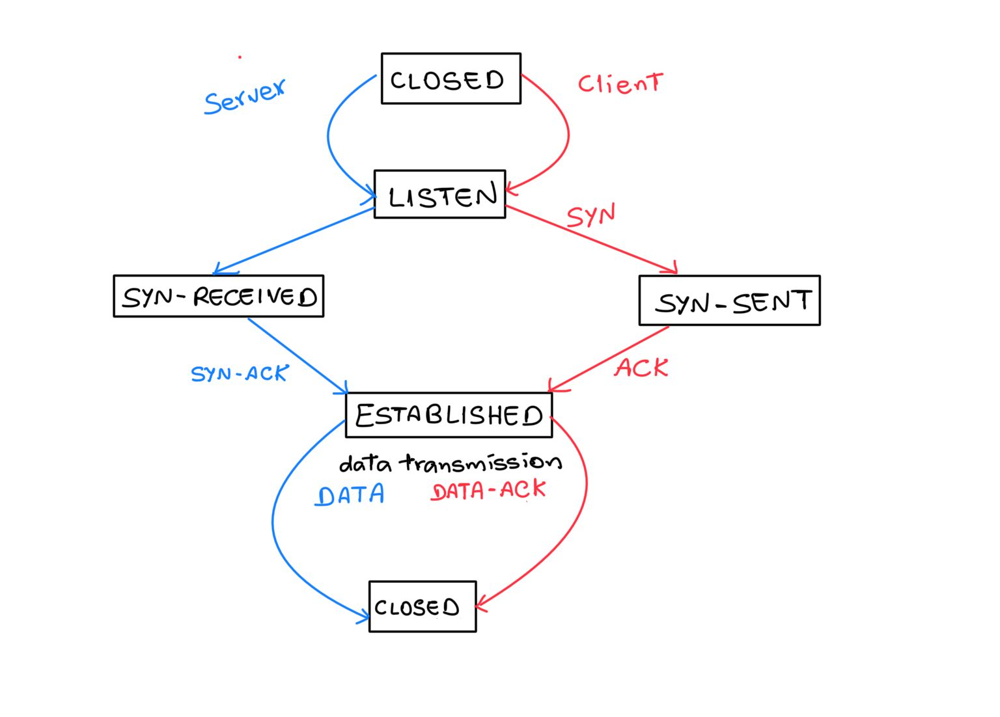

# Project 3: Transport Layer Protocol
## Design Document
-- Oorjit Chowdhary (oorjitc@uw.edu), EE 419/565 - Spring 2025

This project implements a custom reliable transport layer over UDP, simulating TCP-like behavior while adhering to constraints of using a single socket for both sending and receiving data. The server is capable of transmitting files between peers through a three-way handshake, sliding window transmission, per-packet acknowledgments, and retransmissions using timeout-based logic. The server also handles concurrent file transfers by maintaining isolated session state identified by unique session IDs. It supports robustness to packet loss and proper session cleanup after transfer completion or interruption.

### Packet Format
All packets in this protocol follow a structured binary format beginning with a 1-byte packet type field. This is followed by a 16-byte session ID (generated using UUID), allowing for multiplexing concurrent transfers. Data and acknowledgment packets include a 2-byte packet index (big-endian) to identify position in the file. The final structure of each packet type is:

- **SYN (0x00):** 1B type + 16B session ID + 1B filename length + filename
- **SYN-ACK (0x01):** 1B type + 16B session ID + 2B total packet count
- **ACK (0x02):** 1B type + 16B session ID
- **DATA (0x03):** 1B type + 16B session ID + 2B packet index + data
- **DATA-ACK (0x04):** 1B type + 16B session ID + 2B packet index

This compact structure ensures correctness and efficiency even under UDP's unreliable transmission. The index field enables selective acknowledgments and retransmissions, while the session ID ensures all transfers are isolated and independently tracked.

### State Transition Diagram

